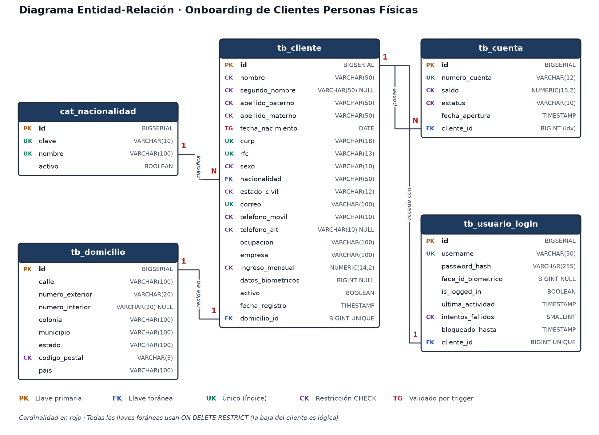
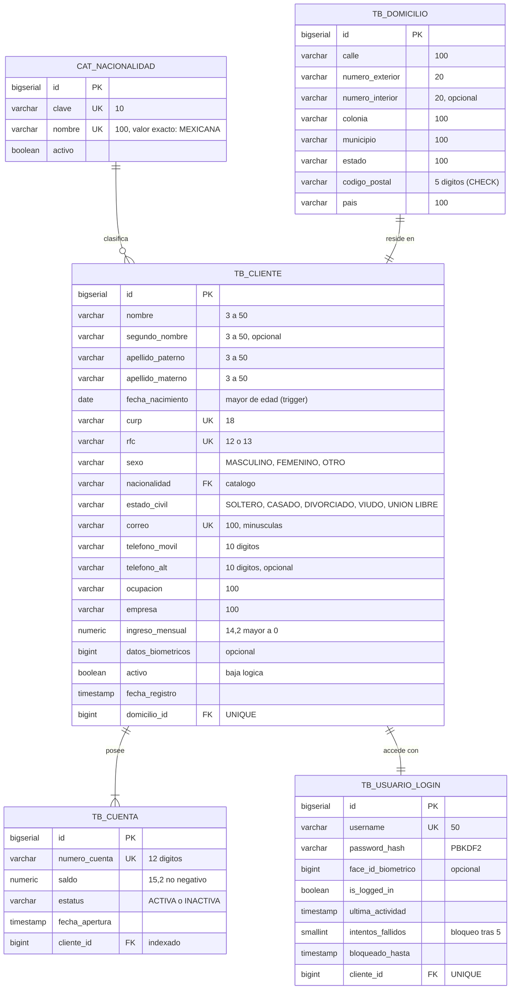
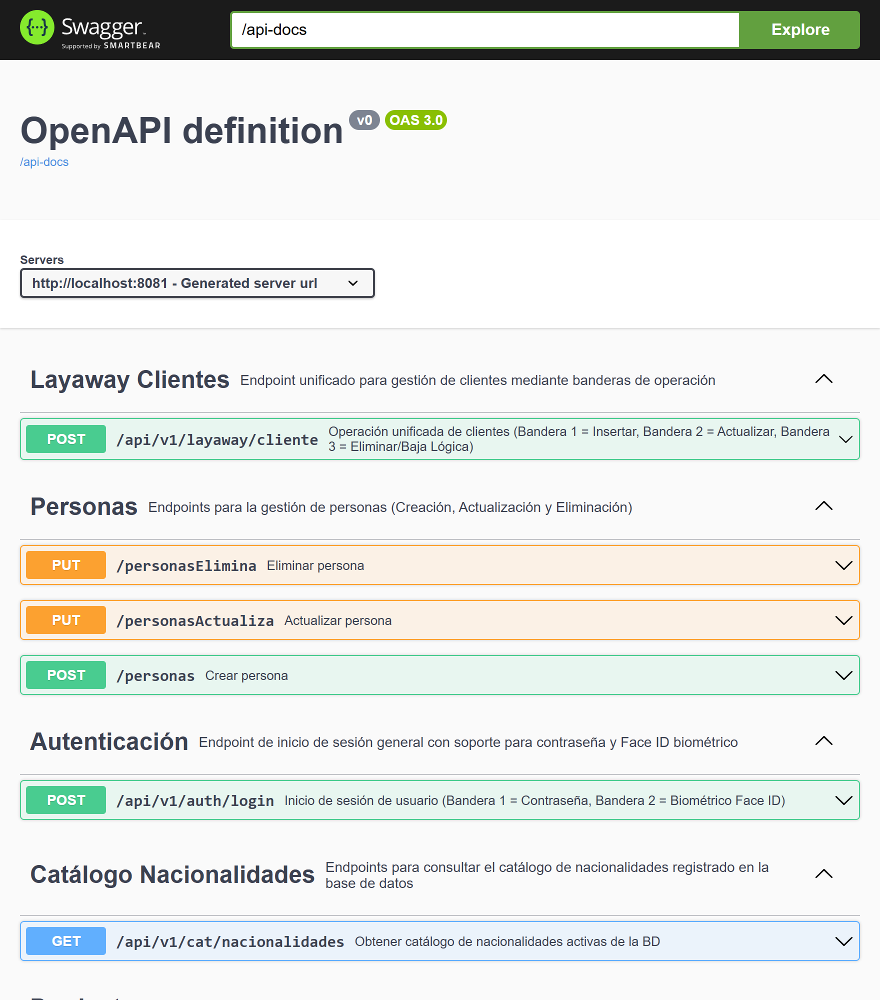
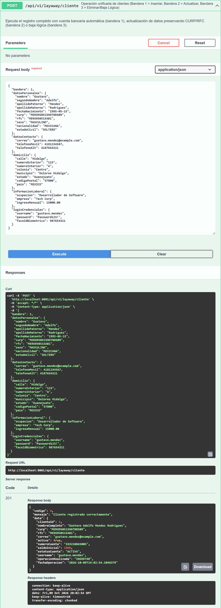
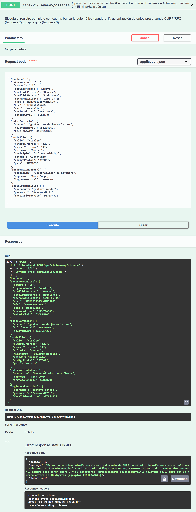
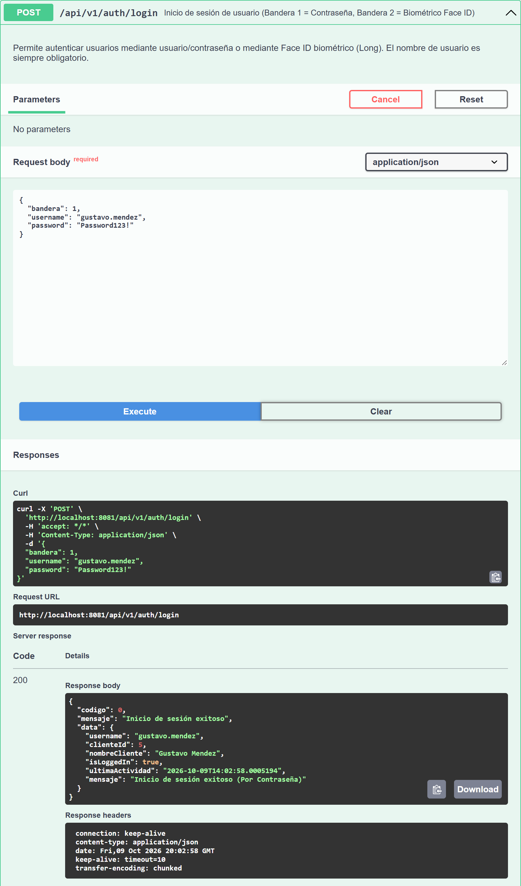
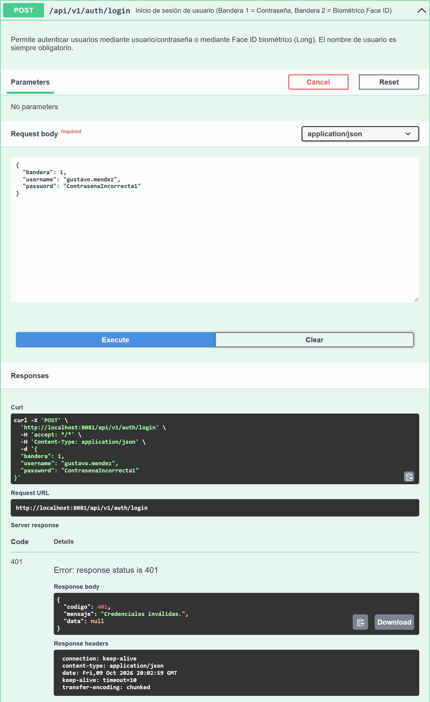
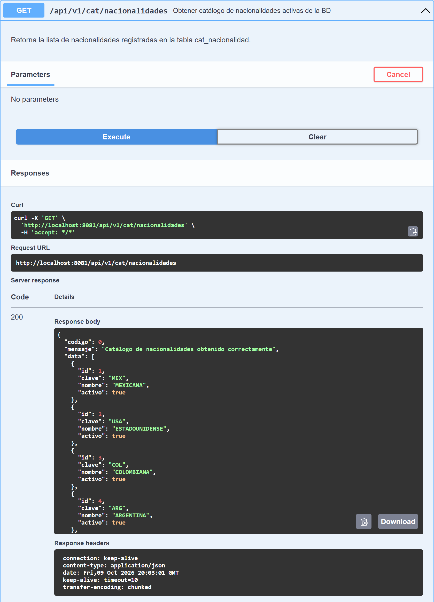

# Proyecto Integrador: Onboarding de Clientes Personas Físicas

API REST en Java / Spring Boot para registrar clientes personas físicas, validar su información, crear automáticamente una cuenta bancaria asociada con saldo inicial y autenticar a los usuarios (contraseña o Face ID).

> **Historia de usuario.** Como ejecutivo de una institución financiera, necesito registrar clientes personas físicas en el sistema para asignarles una cuenta bancaria y permitirles realizar operaciones financieras.

## Entregables

| Entregable | Dónde se encuentra |
|---|---|
| Diagrama entidad-relación | [Sección 3](#3-diagrama-entidad-relación) · imagen: [`docs/base_de_datos/diagrama_er.png`](docs/base_de_datos/diagrama_er.png) |
| Script de creación de base de datos | [Sección 4](#4-base-de-datos) · archivo: [`docs/base_de_datos/script_creacion_bd.sql`](docs/base_de_datos/script_creacion_bd.sql) · migraciones Flyway: [`src/main/resources/db/migration`](src/main/resources/db/migration) |
| Código fuente completo | Este repositorio · estructura en la [Sección 10](#10-estructura-del-código-fuente) |
| API REST funcional | [Sección 5](#5-api-rest) · Swagger UI: `http://localhost:8081/swagger-ui.html` |
| Evidencias de pruebas realizadas | [Sección 9](#9-evidencias-de-pruebas) · carpeta [`docs/evidencias`](docs/evidencias) |
| Documento técnico | [`docs/Documento_Tecnico_Onboarding.docx`](docs/Documento_Tecnico_Onboarding.docx) |

---

## 1. Tecnologías

| Tecnología | Versión / uso |
|---|---|
| Java | 17 (compila también con 21) |
| Spring Boot | 3.3.6 (Web, Validation, Data JPA) |
| Hibernate / JPA | 6.5 |
| PostgreSQL | 14 o superior |
| Flyway | Migraciones versionadas del esquema |
| Gradle | Wrapper incluido (`gradlew` / `gradlew.bat`) |
| Lombok | Reducción de código repetitivo en entidades y DTO |
| springdoc-openapi | Swagger UI / OpenAPI 3 |
| JUnit 5 + Mockito | Pruebas unitarias |

## 2. Cómo ejecutar

1. **Crear la base de datos** en PostgreSQL:
   ```sql
   CREATE DATABASE pago_servicios_db;
   ```
   Las tablas las crea **Flyway automáticamente** al arrancar (migraciones `V3`, `V8` y `V9`). Para crearla manualmente se puede usar [`docs/base_de_datos/script_creacion_bd.sql`](docs/base_de_datos/script_creacion_bd.sql).
2. **Configurar la conexión** en `src/main/resources/application.properties` (`spring.datasource.url`, `username`, `password`). El puerto de la API es `8081`.
3. **Compilar, probar y arrancar:**
   ```powershell
   .\gradlew.bat clean test      # pruebas unitarias
   .\gradlew.bat bootRun         # levanta la API en http://localhost:8081
   ```
4. **Probar la API** desde Swagger UI: `http://localhost:8081/swagger-ui.html`

---

## 3. Diagrama entidad-relación



Versión en Mermaid (GitHub la dibuja automáticamente):



| Relación | Cardinalidad | Implementación |
|---|---|---|
| `cat_nacionalidad` → `tb_cliente` | 1 : N | FK `tb_cliente.nacionalidad` → `cat_nacionalidad.nombre` |
| `tb_domicilio` → `tb_cliente` | 1 : 1 | FK `tb_cliente.domicilio_id` con `UNIQUE` |
| `tb_cliente` → `tb_cuenta` | 1 : N (al menos una, creada en el alta) | FK `tb_cuenta.cliente_id` + índice `idx_cuenta_cliente` |
| `tb_cliente` → `tb_usuario_login` | 1 : 1 | FK `tb_usuario_login.cliente_id` con `UNIQUE` |

Todas las llaves foráneas usan `ON DELETE RESTRICT`: la información nunca se borra físicamente, la baja es lógica (`activo = FALSE`).

---

## 4. Base de datos

### 4.1 Script de creación

- **Script consolidado** (crear la base desde cero): [`docs/base_de_datos/script_creacion_bd.sql`](docs/base_de_datos/script_creacion_bd.sql)
- **Migraciones que ejecuta la aplicación** (Flyway): `V3__create_onboarding_cliente.sql`, `V8__create_cat_nacionalidad.sql` y `V9__endurecer_onboarding_cliente.sql` en [`src/main/resources/db/migration`](src/main/resources/db/migration). La `V9` endurece una base ya existente sin perder datos: normaliza registros históricos y crea las restricciones con `NOT VALID` para no fallar por datos capturados con reglas anteriores.

<details>
<summary><b>Ver el script completo</b></summary>

Contenido íntegro en [`docs/base_de_datos/script_creacion_bd.sql`](docs/base_de_datos/script_creacion_bd.sql). Resumen de su estructura:

1. `cat_nacionalidad` + 11 registros iniciales (MEXICANA, ESTADOUNIDENSE, COLOMBIANA, ARGENTINA, ESPAÑOLA, CANADIENSE, CUBANA, VENEZOLANA, PERUANA, GUATEMALTECA, EXTRANJERA).
2. `tb_domicilio` con `CHECK` de código postal.
3. `tb_cliente` con 4 `UNIQUE`, 2 llaves foráneas y 13 restricciones `CHECK`.
4. `tb_cuenta` con `UNIQUE`, FK, 3 `CHECK` e índice sobre `cliente_id`.
5. `tb_usuario_login` con 2 `UNIQUE`, FK y `CHECK`.
6. Tres funciones + triggers de reglas de negocio.

</details>

### 4.2 Tipos de datos y uso de memoria

| Decisión | Motivo |
|---|---|
| `VARCHAR(n)` ajustado al dominio real (`sexo` 10, `estado_civil` 12, `estatus` 10, `curp` 18, `rfc` 13, `telefono` 10, `codigo_postal` 5) | Documenta el límite, rechaza datos fuera de rango y evita columnas sobredimensionadas. En PostgreSQL `VARCHAR` solo ocupa la longitud real (1 byte de cabecera en cadenas cortas), sin el relleno con espacios de `CHAR(n)`. |
| `NUMERIC(14,2)` para el ingreso y `NUMERIC(15,2)` para el saldo | Precisión decimal exacta para dinero (sin errores de redondeo de `REAL`/`DOUBLE`). Coincide con la validación del API (12 enteros y 2 decimales). |
| `DATE` para la fecha de nacimiento, `TIMESTAMP` para auditoría | No se guarda hora donde no aplica (4 bytes contra 8). |
| `BOOLEAN` para `activo` / `is_logged_in` | 1 byte, en lugar de cadenas como `'S'/'N'`. |
| `SMALLINT` para `intentos_fallidos` | 2 bytes; el valor nunca pasa de unas cuantas unidades. |
| Teléfonos, código postal y CURP como texto | Son identificadores, no cantidades: no se opera aritméticamente con ellos y deben conservar ceros a la izquierda. |
| Sin índices redundantes | Cada `UNIQUE` ya crea su índice B-tree. Se eliminaron 6 índices duplicados (`idx_cliente_curp`, `idx_cliente_rfc`, `idx_cliente_correo`, `idx_cuenta_numero`, `idx_usuario_username`, `idx_usuario_face_id`) que duplicaban espacio y el costo de cada `INSERT`. |
| Índice en la llave foránea `tb_cuenta.cliente_id` | PostgreSQL no indexa las FK automáticamente; se consulta en cada actualización y baja. |

### 4.3 Restricciones e integridad

| Tipo | Restricciones |
|---|---|
| Llaves primarias | `id BIGSERIAL` en todas las tablas |
| Unicidad | CURP, RFC, correo, número de cuenta, username, `domicilio_id`, `cliente_id` (login) |
| Llaves foráneas | `tb_cliente.domicilio_id`, `tb_cliente.nacionalidad`, `tb_cuenta.cliente_id`, `tb_usuario_login.cliente_id` (todas `ON DELETE RESTRICT`) |
| `CHECK` | Longitud de nombres (3–50), formato de CURP y RFC, correo en minúsculas, teléfonos de 10 dígitos, código postal de 5 dígitos, ingreso > 0, saldo ≥ 0, catálogos de sexo, estado civil y estatus, número de cuenta de 12 dígitos |
| Triggers | `trg_cliente_mayor_edad` (18 años o más), `trg_cuenta_cliente_activo` (solo clientes activos tienen cuentas activas), `trg_cliente_baja` (la baja inactiva las cuentas) |

### 4.4 Consultas implementadas (Spring Data JPA)

| Consulta solicitada | Método de repositorio |
|---|---|
| Buscar cliente por CURP | `ClienteRepository.findByCurp(String)` |
| Buscar cliente por RFC | `ClienteRepository.findByRfc(String)` |
| Buscar cliente por correo | `ClienteRepository.findByCorreo(String)` |
| Consultar clientes activos | `ClienteRepository.findByActivoTrue()` |
| Clientes registrados en un rango de fechas | `ClienteRepository.findByFechaRegistroBetween(LocalDateTime, LocalDateTime)` |
| Consultar cuentas activas | `CuentaRepository.findByEstatus("ACTIVA")` |
| Consultar saldo de una cuenta | `CuentaRepository.findByNumeroCuenta(String)` → `getSaldo()` |
| Cuentas de un cliente | `CuentaRepository.findByClienteId(Long)` |

---

## 5. API REST

| Método | Endpoint | Descripción |
|---|---|---|
| `POST` | `/api/v1/layaway/cliente` | Operación unificada de clientes, según el campo `bandera`: **1** = registrar, **2** = actualizar, **3** = baja lógica |
| `POST` | `/api/v1/auth/login` | Inicio de sesión: **1** = contraseña, **2** = Face ID |
| `GET` | `/api/v1/cat/nacionalidades` | Catálogo de nacionalidades activas |

Todas las respuestas usan el mismo envoltorio:

```json
{ "codigo": 0, "mensaje": "Cliente registrado correctamente", "data": { } }
```

### 5.1 Operaciones del endpoint de clientes

| `bandera` | Operación | `clienteId` | Resultado |
|---|---|---|---|
| `1` | Registrar cliente | Nulo o `0` | **201**. Crea el domicilio, el cliente, la cuenta bancaria (número único de 12 dígitos, saldo inicial `1000.00`, estatus `ACTIVA`) y el registro de acceso, todo en una sola transacción |
| `2` | Actualizar datos personales, de contacto, domicilio e información laboral | Obligatorio (> 0) | **200**. CURP y RFC **no** se pueden modificar (400 si se envían distintos); el número de cuenta no forma parte de la petición |
| `3` | Baja lógica | Obligatorio (> 0) | **200**. `activo = false`, cuentas `INACTIVA`, sesión cerrada; no se borra nada |

### 5.2 Validaciones de entrada

| Campo | Regla |
|---|---|
| `nombre`, `apellidoPaterno`, `apellidoMaterno` | Obligatorios, de 3 a 50 caracteres, solo letras y un espacio entre palabras |
| `segundoNombre` | Opcional; si se envía, de 3 a 50 caracteres con las mismas reglas |
| `fechaNacimiento` | Obligatoria, formato estricto `yyyy-MM-dd` (rechaza fechas inexistentes como `1995-02-31`), no futura, 18 años o más |
| `curp` | Obligatoria, 18 caracteres, expresión regular con fecha válida, sexo `H`/`M` y clave de entidad federativa |
| `rfc` | Obligatorio, 12 o 13 caracteres, expresión regular con fecha válida |
| `sexo` | Exactamente `MASCULINO`, `FEMENINO` u `OTRO` |
| `estadoCivil` | Exactamente `SOLTERO`, `CASADO`, `DIVORCIADO`, `VIUDO` o `UNION LIBRE` |
| `nacionalidad` | Exactamente el nombre de una nacionalidad activa del catálogo (p. ej. `MEXICANA`); 404 si no existe |
| `correo` | Obligatorio, formato `usuario@dominio.tld`, máximo 100 caracteres; único sin importar mayúsculas |
| `telefonoMovil` / `telefonoAlt` | Número entero (sin comillas) de exactamente 10 dígitos; el alternativo es opcional |
| `codigoPostal` | Exactamente 5 dígitos |
| `calle`, `colonia`, `municipio`, `estado`, `pais`, `ocupacion`, `empresa` | Obligatorios (número interior opcional), máximo 100 caracteres, sin caracteres de control ni `<` `>` |
| `ingresoMensual` | Mayor a cero, exactamente 2 decimales, máximo 12 enteros |
| `loginCredenciales.username` | 3 a 50 caracteres: letras, números, `.`, `_`, `-` |
| `loginCredenciales.password` | 8 a 72 caracteres, con al menos una letra y un número |
| `bandera`, `clienteId` | Números enteros; se rechaza `"1"` (texto) o `1.5` |

### 5.3 Códigos de respuesta

| HTTP | Cuándo |
|---|---|
| 200 / 201 | Operación exitosa (201 en el registro) |
| 400 | Error de validación, JSON mal formado, tipo de dato incorrecto, intento de cambiar CURP/RFC |
| 401 | Credenciales inválidas (mismo mensaje si el usuario no existe o la contraseña es incorrecta) |
| 403 | Actualizar un cliente dado de baja, o iniciar sesión con un cliente inactivo |
| 404 | Cliente inexistente, o nacionalidad fuera del catálogo |
| 405 / 415 | Método HTTP o `Content-Type` no soportado |
| 409 | CURP, RFC, correo o username ya registrados (también en altas simultáneas) |
| 413 | Cuerpo de la petición mayor a 64 KB (con o sin `Content-Length`) |
| 423 | Cuenta bloqueada 15 minutos tras 5 intentos fallidos de login |
| 503 | Base de datos saturada o no disponible (incluye `Retry-After`) |

### 5.4 Ejemplos reales

Capturados de la API en ejecución. Salida completa: [`docs/evidencias/ejemplos_peticiones_respuestas.txt`](docs/evidencias/ejemplos_peticiones_respuestas.txt).

**Registro (bandera 1)** — `POST /api/v1/layaway/cliente`

```json
{
  "bandera": 1,
  "datosPersonales": {
    "nombre": "Laura", "segundoNombre": "Elena",
    "apellidoPaterno": "Torres", "apellidoMaterno": "Vargas",
    "fechaNacimiento": "1992-08-21",
    "curp": "TOVL920821MGTRRR04", "rfc": "TOVL920821KJ3",
    "sexo": "FEMENINO", "nacionalidad": "MEXICANA", "estadoCivil": "CASADO"
  },
  "datosContacto": { "correo": "laura.torres@example.com", "telefonoMovil": 4181234567, "telefonoAlt": 4187654321 },
  "domicilio": {
    "calle": "Hidalgo", "numeroExterior": "123", "numeroInterior": "A", "colonia": "Centro",
    "municipio": "Dolores Hidalgo", "estado": "Guanajuato", "codigoPostal": "37800", "pais": "MEXICO"
  },
  "informacionLaboral": { "ocupacion": "Contadora", "empresa": "Tech Corp", "ingresoMensual": 15000.00 },
  "loginCredenciales": { "username": "laura.torres", "password": "Password123!", "faceIdBiometrico": 987654321 }
}
```

Respuesta `201 Created`:

```json
{
  "codigo": 0,
  "mensaje": "Cliente registrado correctamente",
  "data": {
    "clienteId": 620,
    "nombreCompleto": "Laura Elena Torres Vargas",
    "curp": "TOVL920821MGTRRR04",
    "rfc": "TOVL920821KJ3",
    "correo": "laura.torres@example.com",
    "activo": true,
    "numeroCuenta": "498094527099",
    "saldoInicial": 1000.00,
    "estatusCuenta": "ACTIVA",
    "username": "laura.torres",
    "operacionRealizada": "INSERTAR",
    "fechaOperacion": "2026-10-09T13:27:13.1467519"
  }
}
```

**Errores representativos:**

```text
Alta duplicada                     -> 409 {"codigo": 409, "mensaje": "Ya existe un cliente registrado con la CURP: TOVL920821MGTRRR04"}
Nombre "Li" y sexo "femenino"      -> 400 {"codigo": 1, "mensaje": "Datos no validos{datosPersonales.sexo=El sexo debe ser exactamente uno de los valores del catálogo: MASCULINO, FEMENINO u OTRO, datosPersonales.nombre=El nombre debe tener entre 3 y 50 caracteres}"}
Actualizar cambiando la CURP       -> 400 {"codigo": 400, "mensaje": "La CURP no puede modificarse. Envíe la CURP registrada o omita el campo."}
Login con contraseña incorrecta    -> 401 {"codigo": 401, "mensaje": "Credenciales inválidas."}
Login con usuario inexistente      -> 401 {"codigo": 401, "mensaje": "Credenciales inválidas."}
Actualizar cliente dado de baja    -> 403 {"codigo": 403, "mensaje": "No se puede actualizar la información de un cliente inactivo."}
Login tras la baja                 -> 403 {"codigo": 403, "mensaje": "El cliente asociado a este usuario se encuentra inactivo."}
```

**Baja lógica (bandera 3):** `{"bandera": 3, "clienteId": 620}` → `200`, con `"activo": false` y `"estatusCuenta": "INACTIVA"`.

**Login (bandera 1):** `{"bandera": 1, "username": "laura.torres", "password": "Password123!"}` → `200` con `"isLoggedIn": true`.

---

## 6. Reglas de negocio

Cada regla se valida en el API **y** en la base de datos, para que no pueda saltarse ni por SQL directo.

| Regla | API | Base de datos |
|---|---|---|
| Mayor de edad (18 años o más) | `@MayorDeEdad` + validación en el servicio | Trigger `trg_cliente_mayor_edad` |
| CURP única | `existsByCurp` → 409 | `UNIQUE (curp)` |
| RFC único | `existsByRfc` → 409 | `UNIQUE (rfc)` |
| Correo único | `existsByCorreo` (en minúsculas) → 409 | `UNIQUE (correo)` + `CHECK` de minúsculas |
| Teléfono de exactamente 10 dígitos | `@Min/@Max` sobre un entero | `CHECK (telefono ~ '^[0-9]{10}$')` |
| Saldo inicial no negativo | Definido por el sistema (`1000.00`) | `CHECK (saldo >= 0)` |
| Número de cuenta único | `SecureRandom` + `existsByNumeroCuenta` | `UNIQUE (numero_cuenta)` + `CHECK` de 12 dígitos |
| Solo clientes activos con cuentas activas | La baja inactiva las cuentas | Triggers `trg_cliente_baja` y `trg_cuenta_cliente_activo` |
| Baja lógica, sin borrado físico | Bandera 3 → `activo = false` | Todas las FK con `ON DELETE RESTRICT` |
| CURP, RFC y número de cuenta inmutables | 400 si cambian en la actualización | — |

## 7. Manejo de excepciones

La aplicación usa la excepción de negocio `OnboardingException` (mensaje + código HTTP), y `GlobalExceptionHandler` (`@RestControllerAdvice`) traduce todos los errores al envoltorio estándar sin exponer detalles internos (SQL, clases o trazas).

| Caso | Respuesta |
|---|---|
| Cliente ya registrado (correo o username duplicados) | 409 |
| CURP duplicada | 409 `Ya existe un cliente registrado con la CURP: ...` |
| RFC duplicado | 409 `Ya existe un cliente registrado con el RFC: ...` |
| Cliente no encontrado | 404 `Cliente no encontrado con ID: ...` |
| Cuenta no encontrada | No ocurre en los endpoints actuales: la cuenta se crea en la misma transacción que el cliente; si un cliente no tuviera cuenta, la respuesta devuelve `numeroCuenta: "N/A"` |
| Error de validación | 400 con el detalle de cada campo inválido |
| Duplicado por condición de carrera (dos altas simultáneas) | 409 (se traduce el error `23505` de PostgreSQL) |
| Base de datos saturada | 503 + `Retry-After` |
| Cualquier error no previsto | 500 genérico; el detalle solo se escribe en el log |

## 8. Seguridad y resistencia a carga

| Riesgo | Medida |
|---|---|
| Contraseñas expuestas si se filtra la base | PBKDF2-HMAC-SHA256 (120,000 iteraciones) con sal aleatoria por usuario; los hashes antiguos se migran solos en el siguiente login |
| Contraseña por defecto conocida | Eliminada: sin contraseña, el acceso por contraseña queda deshabilitado |
| Fuerza bruta en el login | Bloqueo de 15 minutos tras 5 intentos fallidos (423), con conteo atómico en BD |
| Enumeración de usuarios | Mismo código, mensaje **y tiempo de respuesta** para usuario inexistente o contraseña incorrecta |
| Payloads gigantes (DoS de memoria) | Límite de 64 KB, también para cuerpos `Transfer-Encoding: chunked` |
| Inyección SQL | Consultas parametrizadas de JPA + validación de formato en todos los campos |
| XSS almacenado / inyección en logs | Se rechazan `<`, `>`, saltos de línea y caracteres de control |
| Números de cuenta predecibles | `SecureRandom` |
| Agotamiento del pool bajo carga | El hash PBKDF2 se calcula **fuera** de la transacción; pool Hikari configurable y respuesta 503 controlada |
| Altas simultáneas con el mismo CURP | `UNIQUE` en BD + traducción del error a 409 (nunca 500) |

---

## 9. Evidencias de pruebas

### 9.1 Evidencias en Swagger UI — un caso de éxito y uno de error por endpoint

Peticiones reales ejecutadas desde **Swagger UI** (`http://localhost:8081/swagger-ui.html` → *Try it out* → *Execute*) sobre una base de datos de pruebas. Cada captura muestra el cuerpo enviado, el `curl` generado, la URL, el código HTTP y la respuesta del servidor. Archivos y script para reproducirlas: [`docs/evidencias/swagger`](docs/evidencias/swagger).



| Endpoint | Caso | Petición | Resultado | Captura |
|---|---|---|---|---|
| `POST /api/v1/layaway/cliente` | ✅ Éxito | Registro (`bandera: 1`) con datos válidos | **201** · cliente creado, cuenta de 12 dígitos, saldo 1000, `ACTIVA` | [01_cliente_exito_201.png](docs/evidencias/swagger/01_cliente_exito_201.png) |
| `POST /api/v1/layaway/cliente` | ❌ Error | Nombre de 2 letras, sexo `masculino`, CURP con mes 13 y teléfono de 9 dígitos | **400** · detalle de los 4 campos inválidos | [02_cliente_error_400.png](docs/evidencias/swagger/02_cliente_error_400.png) |
| `POST /api/v1/auth/login` | ✅ Éxito | Usuario y contraseña del cliente registrado | **200** · `isLoggedIn: true` | [03_login_exito_200.png](docs/evidencias/swagger/03_login_exito_200.png) |
| `POST /api/v1/auth/login` | ❌ Error | Contraseña incorrecta | **401** · `Credenciales inválidas.` | [04_login_error_401.png](docs/evidencias/swagger/04_login_error_401.png) |
| `GET /api/v1/cat/nacionalidades` | ✅ Éxito | Consulta del catálogo | **200** · nacionalidades activas | [05_catalogo_nacionalidades_exito_200.png](docs/evidencias/swagger/05_catalogo_nacionalidades_exito_200.png) |

**`POST /api/v1/layaway/cliente` — éxito (201)**



**`POST /api/v1/layaway/cliente` — error de validación (400)**



**`POST /api/v1/auth/login` — éxito (200)**



**`POST /api/v1/auth/login` — error de credenciales (401)**



**`GET /api/v1/cat/nacionalidades` — éxito (200)**



> El endpoint del catálogo solo consulta una tabla y no tiene un caso de error propio; los errores del servidor se manejan de forma genérica (500) como se describe en la sección 7.

### 9.2 Pruebas unitarias — 82 de 82 exitosas

`.\gradlew.bat test` (JUnit 5 + Mockito):

| Clase | Pruebas | Qué valida |
|---|---|---|
| `DatosPersonalesDtoValidationTest` | 52 | Nombres (mínimo 3), catálogos estrictos de sexo y estado civil, formato de nacionalidad e intentos de inyección |
| `ClienteLayawayServiceTest` | 11 | Alta, baja lógica, IDs inválidos por bandera, sin contraseña por defecto, nacionalidad fuera de catálogo o en minúsculas (404), CURP inmutable, número de cuenta de 12 dígitos (200 repeticiones) |
| `AuthServiceTest` | 6 | Login por contraseña y Face ID, mismo 401 para usuario inexistente, registro de intentos fallidos, cuenta bloqueada (423), no revelar cliente inactivo |
| `PasswordEncoderUtilTest` | 3 | Sal aleatoria (hashes distintos), compatibilidad con hashes antiguos, hashes malformados |
| `ProductosServiceImplTest` | 10 | Módulo GestoPago (anexo) |

### 9.3 Pruebas de seguridad, validación, concurrencia y carga — 139 de 139 exitosas

Script reproducible (solo librería estándar de Python): [`docs/evidencias/pruebas_seguridad_carga.py`](docs/evidencias/pruebas_seguridad_carga.py) · resultado completo: [`docs/evidencias/resultado_pruebas_seguridad_carga.txt`](docs/evidencias/resultado_pruebas_seguridad_carga.txt)

| Categoría | Casos | Ejemplos |
|---|---|---|
| Registro y validaciones del documento | 84 | Nombres de 2/3/51 letras, CURP/RFC con mes 13 o día 32, correo sin dominio, fecha `1995-02-31`, menor de edad por un día, teléfonos de 9/11 dígitos o como texto, código postal inválido, ingreso `0.00`, negativo o `1e999999999`, catálogos con variantes |
| Unicidad | 10 | CURP, RFC, correo (incluso en mayúsculas) y username duplicados |
| Bandera / JSON | 15 | Bandera como texto o decimal, JSON roto o anidado 5,000 niveles, cuerpo de 200 KB, cuerpo *chunked* de 2 MB, `Content-Type` incorrecto |
| Actualizar / baja | 12 | Intento de cambiar CURP o RFC, robar el correo de otro cliente, actualizar a un cliente dado de baja |
| Login | 15 | Contraseña por defecto, fuerza bruta (bloqueo al 5.º intento), enumeración por código y por **tiempo** (67 ms contra 68 ms) |
| Concurrencia y carga | 3 | 30 altas simultáneas con la misma CURP (1 creada, 29 rechazadas con 409); **600 altas con 100 hilos: 0 errores (170 altas/s)**; 400 logins concurrentes |

### 9.4 Reglas en la base de datos — 12 de 12

La base rechaza por sí misma los datos inválidos aunque se manipule por SQL directo (sexo en minúsculas, nacionalidad fuera del catálogo, menor de edad, saldo negativo, borrado físico, reactivar la cuenta de un cliente dado de baja…). Detalle: [`docs/evidencias/pruebas_reglas_base_de_datos.txt`](docs/evidencias/pruebas_reglas_base_de_datos.txt)

---

## 10. Estructura del código fuente

```
src/main/java/com/proyecto/servicios/
├── controller/onboarding/
│   ├── ClienteLayawayController.java   # POST /api/v1/layaway/cliente (banderas 1, 2, 3)
│   ├── AuthController.java             # POST /api/v1/auth/login
│   └── CatNacionalidadController.java  # GET  /api/v1/cat/nacionalidades
├── service/onboarding/
│   ├── ClienteLayawayService.java      # Lógica de negocio: alta + cuenta automática, actualización, baja lógica
│   └── AuthService.java                # Login, bloqueo por intentos, expiración de sesión
├── entity/onboarding/                  # Entidades JPA: Cliente, Domicilio, Cuenta, UsuarioLogin, CatNacionalidad
├── repositorys/onboarding/             # Repositorios Spring Data JPA (incluye las consultas solicitadas)
├── dto/onboarding/                     # DTO de petición/respuesta con Bean Validation
├── validation/                         # @MayorDeEdad, @DosDecimales, FechaEstrictaDeserializer
├── exception/                          # OnboardingException + GlobalExceptionHandler
└── config/                             # Pool de BD, Flyway, Jackson estricto, límite de tamaño, PasswordEncoderUtil
src/main/resources/db/migration/        # Migraciones Flyway (V3, V8, V9 para onboarding)
src/test/java/                          # Pruebas unitarias
docs/
├── base_de_datos/                      # Script de creación y diagrama ER
├── evidencias/                         # Resultados y scripts de prueba
└── Documento_Tecnico_Onboarding.docx   # Documento técnico
```

---

# Anexo: Integración de Productos GestoPago

> Documentación del módulo de productos previo al proyecto de onboarding; se conserva sin cambios.

## 1. Objetivo
El objetivo de esta integración es consumir el servicio externo de GestoPago para obtener el catálogo de productos disponibles (`GET /sistema/service/getProductList.do`), procesar la respuesta en formato XML a través de Jackson XML, mapearla a nuestro DTO interno (`ProductoResponse`) y exponerla a los clientes de nuestra plataforma mediante el endpoint `GET /productos` envuelta en un formato estandarizado `GenericResponse`.

---

## 2. Endpoints y Configuración

### Endpoints
- **Endpoint Interno Lista Plana (Filtro opcional)**: `GET /productos` o `GET /productos?tipoFront=1`
- **Endpoint Interno Agrupado por tipoFront**: `GET /productos/agrupados`
- **Endpoint Externo (Proveedor)**: `GET /sistema/service/getProductList.do`
- **Endpoint Autenticación Proveedor**: `POST /sistema/app/jwt-gp/authenticate/`
- **URL Base Proveedor**: `https://gestopago.portalventas.net`

### Propiedades de Configuración (`application.properties`)
```properties
# Base URL GestoPago
gestopago.base-url=https://gestopago.portalventas.net

# Autenticación GestoPago
gestopago.auth.id-distribuidor=YOUR_DISTRIBUIDOR_ID
gestopago.auth.codigo-dispositivo=YOUR_DEVICE_CODE
gestopago.auth.password=YOUR_PASSWORD
gestopago.auth.refresh-rate-ms=3600000

# Endpoint y Timeouts de Productos
gestopago.productos.endpoint=/sistema/service/getProductList.do
gestopago.productos.connect-timeout=5000
gestopago.productos.read-timeout=10000
```

---

## 3. Flujo de Autenticación, Almacenamiento y Renovación de Token

1. **Obtención de Token**: El cliente de autenticación `GestoPagoAuthClient` solicita el JWT invocando `POST /sistema/app/jwt-gp/authenticate/` con `idDistribuidor`, `codigoDispositivo` y `password`.
2. **Persistencia y Actualización**: `GestoPagoTokenServiceImpl` guarda o actualiza la entidad `GestoPagoToken` mediante `GestoPagoTokenRepository` y `GestoPagoTokenMapper`.
3. **Mantenimiento Programado**: Se ejecuta `@Scheduled(fixedRateString = "${gestopago.auth.refresh-rate-ms:3600000}")` para renovar el token proactivamente cada hora.
4. **Renovación On-Demand**: Cuando `ProductosServiceImpl` consulta el token activo a `GestoPagoTokenService` y no existe uno presente, invoca automáticamente `tokenService.renovarToken()` antes de realizar la petición HTTP externa.
5. **Formato Header**: La petición externa incluye `Authorization: Bearer <token>`. Si el atributo `token_type` del proveedor viene vacío o nulo, se utiliza `"Bearer"` como valor predeterminado.

---

## 4. Estructura de Capas y Arquitectura

```
src/main/java/com/proyecto/servicios/
├── client/
│   ├── GestoPagoAuthClient.java       # Cliente Feign para autenticación
│   └── ProductosClient.java           # Cliente Feign para obtención de productos
├── config/
│   ├── ConfigDB.java                  # Configuración de base de datos
│   ├── FlywayConfig.java              # Configuración de migraciones DB
│   ├── OpenApi.java                   # Configuración OpenAPI / Swagger
│   └── ProductosFeignConfig.java      # Configuración de timeouts de Feign
├── controller/
│   └── ProductosController.java       # Endpoint REST GET /productos
├── entity/gestopago/
│   └── GestoPagoToken.java            # Entidad JPA para tokens
├── enums/
│   └── ErrorCode.java                 # Enum estandarizado de errores
├── exception/
│   ├── IntegrationException.java      # Excepción personalizada de integración
│   └── GlobalExceptionHandler.java    # Controlador global de excepciones @RestControllerAdvice
├── model/
│   ├── GenericResponse.java           # Envoltorio genérico para respuestas API
│   ├── gestopago/
│   │   └── GestoPagoAuthResponse.java # DTO respuesta de autenticación
│   └── productos/
│       ├── MensajeXml.java            # Jackson XML element <MENSAJE>
│       ├── ProductoXml.java           # Jackson XML element <producto>
│       ├── ProductosXml.java          # Jackson XML container <PRODUCTOS>
│       ├── ProductosXmlResponse.java  # Jackson XML root <RESPONSE>
│       └── ProductoResponse.java      # DTO interno expuesto por la API
├── repositorys/gestopago/
│   └── GestoPagoTokenRepository.java  # Repositorio Spring Data JPA
└── service/
    ├── GestoPagoTokenService.java     # Interfaz gestión de tokens
    ├── ProductosService.java          # Interfaz gestión de productos
    └── Impl/
        ├── GestoPagoTokenServiceImpl.java # Implementación servicio tokens
        └── ProductosServiceImpl.java     # Implementación servicio productos
```

---

## 5. Transformaciones de Modelos (XML a DTO Interno)

1. **Modelos Externos XML**: Jackson XML deserializa la respuesta del proveedor en la jerarquía:
   - `<RESPONSE>` -> `ProductosXmlResponse`
   - `<MENSAJE>` -> `MensajeXml`
   - `<PRODUCTOS><producto ... /></PRODUCTOS>` -> `ProductosXml` y `ProductoXml`.
2. **Modelo Interno JSON**: `ProductosServiceImpl` transforma cada `ProductoXml` a `ProductoResponse`, omitiendo envoltorios externos como `<RESPONSE>`, `<MENSAJE>`, `<CODIGO>` o `<TEXTO>` del proveedor.

---

## 6. Respuestas y Códigos de Error (`ErrorCode`)

### Respuesta Exitosa (`codigo: 0`)
La API interna responde **exclusivamente con HTTP 200 y código 0**:
```json
{
  "codigo": 0,
  "mensaje": "Productos obtenidos correctamente",
  "data": [
    {
      "servicio": "Recarga",
      "producto": "Telcel $100",
      "idServicio": "1",
      "idProducto": "100",
      "idCatTipoServicio": "2",
      "tipoFront": "S",
      "hasDigitoVerificador": false,
      "precio": "100.0",
      "showAyuda": false,
      "tipoReferencia": "NUMERO",
      "legend": "Ingresa tu número"
    }
  ]
}
```

### Tabla de Códigos `ErrorCode`
| Código | Name | Descripción | HTTP Status MAPEADO |
|---|---|---|---|
| **0** | `SUCCESS` | Operación exitosa (reservado solo para éxito) | 200 OK |
| **1** | `AUTHENTICATION_ERROR` | Error de autenticación (HTTP 401, 403 o token nulo/inválido) | 401 UNAUTHORIZED |
| **2** | `HTTP_ERROR` | Respuesta no exitosa del servicio externo (ej. HTTP 500) | 502 BAD GATEWAY |
| **3** | `TIMEOUT_ERROR` | Tiempo de espera agotado (Timeout en conexión o lectura) | 504 GATEWAY TIMEOUT |
| **4** | `COMMUNICATION_ERROR` | Error de comunicación o red | 502 BAD GATEWAY |
| **5** | `INVALID_RESPONSE` | Respuesta nula, incompleta o sin mensaje válido | 502 BAD GATEWAY |
| **6** | `CONFIGURATION_ERROR` | Error de configuración o credenciales faltantes | 500 INTERNAL SERVER ERROR |
| **7** | `INTERNAL_ERROR` | Error interno del sistema | 500 INTERNAL SERVER ERROR |

---

## 7. Estrategia de Logs y Seguridad

### Información NO registrada en logs (Protección de Datos Sensibles)
- Passwords de usuario/sistema.
- Tokens JWT completos.
- Cabeceras de autorización `Authorization: Bearer ...`.
- Cuerpos completos de respuestas sensibles.

### Información SI registrada en logs
- Inicio y fin de la consulta de productos.
- Cantidad total de productos obtenidos.
- Status HTTP en caso de errores de comunicación o integración.
- Clasificación limpia del error sin exponer datos confidenciales.

---

## 8. Cobertura de Pruebas Unitarias

Se implementó la suite de pruebas `ProductosServiceImplTest` en `src/test/java/com/proyecto/servicios/service/ProductosServiceImplTest.java` utilizando `@ExtendWith(MockitoExtension.class)` y JUnit 5, cubriendo 10 escenarios obligatorios:

1. **Consulta exitosa con token existente**: Verifica deserialización, transformación y envío de header `Bearer token-prueba`.
2. **Renovación cuando no existe token**: Verifica `verify(tokenService).renovarToken()` y re-consulta exitosa del token.
3. **Error de autenticación HTTP 401**: Verifica lanzamiento de `IntegrationException` con `ErrorCode.AUTHENTICATION_ERROR`.
4. **Error de autenticación HTTP 403**: Verifica `AUTHENTICATION_ERROR`.
5. **Error HTTP 500**: Verifica `ErrorCode.HTTP_ERROR`.
6. **Timeout**: Simulación con `FeignException.GatewayTimeout` y `SocketTimeoutException` validando `ErrorCode.TIMEOUT_ERROR`.
7. **Respuesta null**: Verifica `ErrorCode.INVALID_RESPONSE`.
8. **Respuesta sin mensaje**: Verifica `ErrorCode.INVALID_RESPONSE`.
9. **Token vacío o no disponible**: Verifica `AUTHENTICATION_ERROR` y `verifyNoInteractions(productosClient)`.
10. **Validación de DTO `ProductoResponse`**: Comprobación exhaustiva de `equals`, `hashCode`, `toString`, `assertAll`, `assertTrue` y `assertFalse`.

---

## 9. Comandos de Verificación y Redis

Para iniciar y gestionar la caché de Redis local, consulta [INICIALIZAR_REDIS.md](file:///d:/INGENIERIA_UTNG/10mo/unidad%201/prueba/prueba/INICIALIZAR_REDIS.md).

Para ejecutar la compilación, pruebas unitarias y arranque del proyecto:

```powershell
# 1. Limpieza y compilación Java
.\gradlew.bat clean compileJava

# 2. Ejecución de suite completa de pruebas unitarias
.\gradlew.bat clean test

# 3. Iniciar la aplicación Spring Boot
.\gradlew.bat bootRun
```
